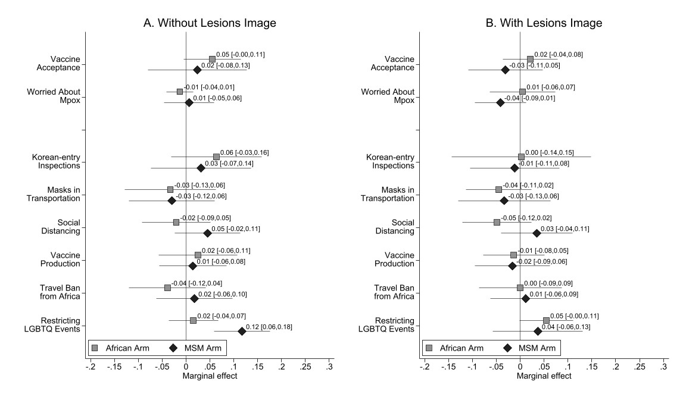
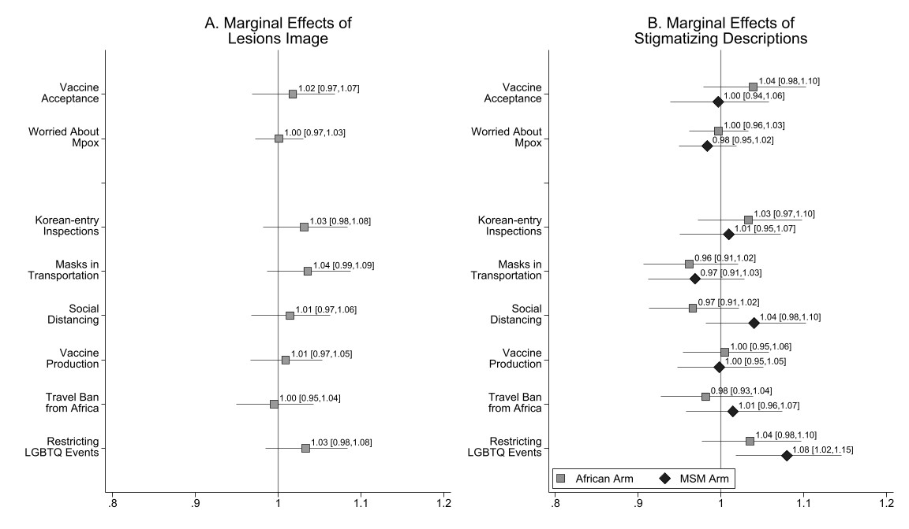

# Communities at Risk for Mpox and Stigmatizing Policies: A Randomized Survey, Republic of Korea, 2022

*Paper Authors: Yongjin Choi and Ashley M. Fox* </br> *Script Author: Yongjin Choi* </br> *Last updated: Nov. 12. 2023*</br></br>
*Journal: American Journal of Public Health*</br>
*Suggested citation: Choi, Y., & Fox, A. M. (2023). Communities at Risk for Mpox and Stigmatizing Policies: A Randomized Survey, Republic of Korea, 2022. American Journal of Public Health, 113(10), 1120-1127.*</br>

* What's Included
  * [Part I. Basic Setting](#part-i-basic-setting)
  * [Part II. Data Prep](#part-ii-data-prep)
    - Merging
    - Cleaning
      - Variables
      - Appendix 1 & 2
  * [Part III. Data Review](#part-iii-data-review)
    - Table 1. Descriptive Statistics
  * [Part IV. Analysis](#part-iv-estimation)
    - Figure 1
    - Appendix D
    - Appendix F
    - Appendix G

# I. Basic Setting


```stata
********************************************************************************
/*----- Basic Setting -----*/
********************************************************************************

/*----- Essentials -----*/

clear all
qui global localpath "C:\Dropbox\05_Git\covid-survey-korea-2022\01. Mpox experiment"
cd "$localpath"
cap mkdir "$localpath\img"
qui global rawdata "C:\Dropbox\02_Data"
qui global outputs "$localpath\img"

* Output width
set linesize 240
display "{hline}"

* Color scheme for plots
colorpalette #176d90 #841618 #f18821 #3d7337 #a039b7 #009999 #cc6699 #ff6633 #cccc33 #9e6eac, globals
qui grstyle clear
qui set scheme s2color
qui grstyle init
qui grstyle set plain, horizontal grid
qui grstyle color background white
qui grstyle yesno draw_major_hgrid yes
qui grstyle yesno draw_major_ygrid yes
qui grstyle color major_grid none
qui grstyle linepattern major_grid solid
qui grstyle linewidth major_grid vvthin
qui grstyle set legend 4, box inside
qui grstyle color ci_area gs12%50
```

### (Optional) Packages required


```stata
/*----- (Optional) Installing Packages -----*/
ssc install estout, replace
ssc install coefplot, replace
ssc install grstyle, replace
ssc install palettes, replace
ssc install colrspace, replace
```

# II. Data Prep


```stata
********************************************************************************
/*----- Part II. Data Prep -----*/
********************************************************************************
```


```stata
import delimited "$rawdata\01_Survey\2022_Korea Vaccine Survey\HBK_Public\HBK_W2_20220707.csv", clear
save "HBK_W2", replace

/*----- Outcomes -----*/
* Mpox vaccination
recode exp2_1 (1/3=0 "No/Don't know") (4/5=1 "Yes"), gen(EXP2_INTN)

* Anxiety
recode exp2_2 (1/3=0 "No/Don't know") (4/5=1 "Yes"), gen(EXP2_WORR)

* Policy support
gen EXP2_PLCY_INSP = 0
gen EXP2_PLCY_AFRI = 0
gen EXP2_PLCY_MASK = 0
gen EXP2_PLCY_VACC = 0
gen EXP2_PLCY_LGBT = 0
gen EXP2_PLCY_DIST = 0
gen EXP2_PLCY_NOTH = 0

replace EXP2_PLCY_INSP = 1 if exp2_3a!=.
replace EXP2_PLCY_AFRI = 1 if exp2_3b!=.
replace EXP2_PLCY_MASK = 1 if exp2_3c!=.
replace EXP2_PLCY_VACC = 1 if exp2_3d!=.
replace EXP2_PLCY_LGBT = 1 if exp2_3e!=.
replace EXP2_PLCY_DIST = 1 if exp2_3f!=.
replace EXP2_PLCY_NOTH = 1 if exp2_3g!=.

/*----- Treatments -----*/
gen EXP2_TREAT_IMG = 0
gen EXP2_TREAT_STG = 0
replace EXP2_TREAT_IMG = 1 if exp2==2 | exp2==4 | exp2==6
replace EXP2_TREAT_STG = 1 if exp2==3 | exp2==4
replace EXP2_TREAT_STG = 2 if exp2==5 | exp2==6

/*----- Control variables -----*/
* Ideology
recode po001 (1 2=0 "Liberal") (3=2 "Independent") (4 5=1 "Conservative"), gen(IDEOLOGY)
label var IDEOLOGY "Ideology"

* Sociodemographic variables
recode age (1/29=0 "18-29") (30/39=1 "30s") (40/49=2 "40s") (50/59=3 "50s") (60/100=4 "60s"), gen(AGE)
recode sex (1=0 "Male") (2=1 "Female"), gen(FEMALE)
recode edu (1 2=0 "High school or less") (3=1 "Associate/Bachelor") (4 5=2 "Graduate"), gen(EDU)
recode job (2=0 "Employee") (1=1 "Health care worker") (3/7=2 "Other"), gen(JOB)
recode ms (2/4=0 "Not married") (1=1 "Married"), gen(MS)
recode rel (5=0 "No religion") (1/4 6=1 "Religion"), gen(REL)
recode income (1/4=0 "<₩2M") (5/8=1 "₩2M-₩3.99M") (9/10=2 "₩4M-₩5.99M") (11/12=3 "₩6M-₩7.99M") (13/15=4 ">₩7.99M"), gen(INCOME)

/*----- Labeling -----*/
label var EXP2_INTN "Mpox vaccine intention"
label var EXP2_WORR "Anxiety of getting Mpox"

label var EXP2_PLCY_INSP "Korean-entry Inspection"
label var EXP2_PLCY_MASK "Masks at Public Transportation"
label var EXP2_PLCY_DIST "Social Distancing"
label var EXP2_PLCY_VACC "Vaccine Production"
label var EXP2_PLCY_AFRI "Travel Ban from Africa"
label var EXP2_PLCY_LGBT "Restrictions on LGBTQ Events"

label var AGE "Age"
label var FEMALE "Female"
label var EDU "Education"
label var JOB "Job Status"
label var MS "Marital Status"
label var REL "Religiosity"
label var INCOME "HH Income"

egen count_sample = count(EDU), by(EDU)

xtset prvc
save "HBK_W2_clean", replace
```

# III. Data Review

## Table 1. Descriptive Statistics


```stata
capt prog drop ctab
program ctab, eclass
    syntax varlist [if] [in]
    * Row 1: No. of Observations
    qui tab WAVE
    matrix temp = r(N)
    local c1 = temp[1,1]
    qui tab WAVE if EXP2_TREAT_IMG == 1
    matrix temp = r(N)
    local c2 = temp[1,1]
    qui tab WAVE if EXP2_TREAT_IMG == 0
    matrix temp = r(N)
    local c3 = temp[1,1]
    qui tab WAVE if EXP2_TREAT_STG == 0
    matrix temp = r(N)
    local c4 = temp[1,1]
    qui tab WAVE if EXP2_TREAT_STG == 1
    matrix temp = r(N)
    local c5 = temp[1,1]
    qui tab WAVE if EXP2_TREAT_STG == 2
    matrix temp = r(N)
    local c6 = temp[1,1]
    mat M = (`c1',`c2',`c3',`c4', `c5', `c6')
    mat rownames M = "No of Obs"
    mat colnames M = "All" "Arm1: Yes" "Arm1: No" "Arm2: Control" "Arm2: Afri" "Arm2: MSM"

    local num = 0
    foreach x in `varlist'{
        local num = `num' + 1

        qui sum `x'
        matrix temp = r(mean)
        local m1 = temp[1,1]*100
        qui sum `x' if EXP2_TREAT_IMG == 1
        matrix temp = r(mean)
        local m2 = temp[1,1]*100
        qui sum `x' if EXP2_TREAT_IMG == 0
        matrix temp = r(mean)
        local m3 = temp[1,1]*100
        qui sum `x' if EXP2_TREAT_STG == 0
        matrix temp = r(mean)
        local m4 = temp[1,1]*100
        qui sum `x' if EXP2_TREAT_STG == 1
        matrix temp = r(mean)
        local m5 = temp[1,1]*100
        qui sum `x' if EXP2_TREAT_STG == 2
        matrix temp = r(mean)
        local m6 = temp[1,1]*100

        mat temp = (`m1',`m2',`m3',`m4',`m5',`m6')
        local rowname: variable label `x'
        mat rownames temp = "`rowname'"
        mat M = M\temp
    }
    esttab matrix(M, fmt("0 2"))
    esttab matrix(M, fmt("0 2")) using "$outputs4\Table1.rtf", replace
end
```


```stata
use "HBK_W2_clean", clear
gen WAVE=2

qui tab IDEOLOGY, gen(IDEOLOGY_)
label var IDEOLOGY_1 "Liberal"
label var IDEOLOGY_2 "Independent"
label var IDEOLOGY_3 "Conservative"
qui tab AGE, gen(AGE_)
qui tab EDU, gen(EDU_)
label var EDU_1 "High school or less"
label var EDU_2 "BA"
label var EDU_3 "MA or more"
qui tab JOB, gen(JOB_)
label var JOB_1 "Employees"
label var JOB_2 "Health care workers"
label var JOB_3 "Unemployed/other"
qui tab INCOME, gen(INCOME_)
label var INCOME_1 "<₩2M"
label var INCOME_2 "₩2M-₩3.99M"
label var INCOME_3 "₩4M-₩5.99M"
label var INCOME_4 "₩6M-₩7.99M"
label var INCOME_5 ">₩7.99M"

ctab EXP2_INTN EXP2_WORR EXP2_PLCY_INSP EXP2_PLCY_MASK EXP2_PLCY_DIST EXP2_PLCY_VACC EXP2_PLCY_AFRI EXP2_PLCY_LGBT ///
    FEMALE REL IDEOLOGY_1-IDEOLOGY_3 AGE_1-AGE_5 EDU_1-EDU_3 MS JOB_1-JOB_3 REL INCOME_1-INCOME_5
```

    
    
    
    
    
    
    
    
    
    
    
    
    
    
    
    
    
    
    
    
    
    
    
    ------------------------------------------------------------------------------------------
                            M                                                                 
                          All     Arm1:Yes      Arm1:No Arm2:Control    Arm2:Afri     Arm2:MSM
    ------------------------------------------------------------------------------------------
    No of Obs            1500          750          750          500          500          500
    Mpox vacci~n        45.07        46.40        43.73        44.20        47.20        43.80
    Anxiety of~x         9.13         9.07         9.20        10.00         9.40         8.00
    Korean-ent~n        59.13        60.67        57.60        57.40        61.20        58.80
    Masks at P~n        38.47        40.27        36.67        40.60        37.00        37.80
    Social Dis~g        34.73        35.73        33.73        34.40        31.20        38.60
    Vaccine Pr~n        24.13        24.67        23.60        24.20        24.40        23.80
    Travel Ban~a        33.20        32.80        33.60        33.20        31.40        35.00
    Restrictio~s        38.40        39.47        37.33        34.80        38.20        42.20
    Female              49.00        49.60        48.40        45.60        51.80        49.60
    Religiosity         46.00        45.73        46.27        46.40        44.80        46.80
    Liberal             24.87        26.67        23.07        23.20        26.00        25.40
    Independent         22.13        20.27        24.00        23.40        19.80        23.20
    Conservative        53.00        53.07        52.93        53.40        54.20        51.40
    AGE==18-29          19.53        18.80        20.27        19.20        20.00        19.40
    AGE==30s            17.53        17.87        17.20        18.40        17.60        16.60
    AGE==40s            21.27        20.67        21.87        20.00        21.00        22.80
    AGE==50s            22.60        22.93        22.27        22.60        23.00        22.20
    AGE==60s            19.07        19.73        18.40        19.80        18.40        19.00
    High schoo~s        20.80        22.93        18.67        18.40        19.80        24.20
    BA                  65.33        62.13        68.53        68.20        66.00        61.80
    MA or more          13.87        14.93        12.80        13.40        14.20        14.00
    Marital St~s        54.60        54.93        54.27        56.40        53.40        54.00
    Employees           53.40        52.13        54.67        51.40        55.00        53.80
    Health car~s         6.87         6.40         7.33         7.00         7.20         6.40
    Unemployed~r        39.73        41.47        38.00        41.60        37.80        39.80
    Religiosity         46.00        45.73        46.27        46.40        44.80        46.80
    <₩2M                11.80        14.00         9.60        12.20        11.40        11.80
    ₩2M-₩3.99M          31.93        31.73        32.13        29.00        35.40        31.40
    ₩4M-₩5.99M          27.80        28.27        27.33        30.00        24.60        28.80
    ₩6M-₩7.99M          14.67        12.80        16.53        14.60        14.80        14.60
    >₩7.99M             13.80        13.20        14.40        14.20        13.80        13.40
    ------------------------------------------------------------------------------------------
    (output written to C:\Dropbox\01_Research\107_Korean Vaccine Survey\02_Analysis\outputs\04_MonkeypoxExp\Table1.rtf)
    

# 4. Estimation

## Figure 1. Marginal Effects of Lesions Image and Stigmatizing Descriptions


```stata
xtset prvc
loc controls i.IDEOLOGY i.FEMALE i.AGE i.EDU i.MS i.JOB i.REL i.INCOME
loc vars EXP2_INTN EXP2_WORR EXP2_WORR EXP2_PLCY_INSP EXP2_PLCY_MASK EXP2_PLCY_DIST EXP2_PLCY_VACC EXP2_PLCY_AFRI EXP2_PLCY_LGBT
loc i = 0
loc xrange -0.2(0.05)0.2

loc title0 "What shoud the government do to protect people from Monkeypox?"
loc title1 `""A. Effects of" "Lesions Image""'
loc title2 `""B. Effects of" "Stigmatizing Descriptions""'

matrix IMG = J(9, 3, .)
matrix coln IMG = Beta LI95 UI95
matrix AFR = J(9, 3, .)
matrix coln AFR = Beta LI95 UI95
matrix MSM = J(9, 3, .)
matrix coln MSM = Beta LI95 UI95

foreach y in `vars' {
    loc i = `i' + 1
    
    eststo lmM`i': qui xtreg `y' i.EXP2_TREAT_IMG##i.EXP2_TREAT_STG `controls', fe robust
    *matrix IMG[`i',1] = r(table)[1,2], r(table)[5,2], r(table)[6,2]
    *matrix AFR[`i',1] = r(table)[1,4], r(table)[5,4], r(table)[6,4]
    *matrix MSM[`i',1] = r(table)[1,5], r(table)[5,5], r(table)[6,5]
    qui margins, dydx(EXP2_TREAT_IMG)
    matrix IMG[`i',1] = r(table)[1,2], r(table)[5,2], r(table)[6,2]
    qui margins, dydx(EXP2_TREAT_STG)
    matrix AFR[`i',1] = r(table)[1,2], r(table)[5,2], r(table)[6,2]
    matrix MSM[`i',1] = r(table)[1,3], r(table)[5,3], r(table)[6,3]
}

mat IMG[3,1]=.,.,.
mat AFR[3,1]=.,.,.
mat MSM[3,1]=.,.,.

qui coefplot (matrix(IMG[,1]), ci((2 3)) mfcolor(gs8*0.8)), ///
         title(`title1') xtitle("OLS Coefficient") ///
         coeflabels(r1=`""Vaccine" "Acceptance""' r2=`""Worried About" "Mpox""' ///
                    r3=" " r4=`""Korean-entry" "Inspections""' r5=`""Masks in" "Transportation""' r6=`""Social" "Distancing""' ///
                    r7=`""Vaccine" "Production""' r8=`""Travel Ban" "from Africa""' r9=`""Restricting" "LGBTQ Events""', wrap(30)) ///
         xlabel(`xrange') ylabel(, nogrid) ///
         xline(0, lcolor(gray) lwidth(medium)) ///
         plotregion(lwidth(thin) lpattern(solid)) ///
         msize(large) mlwidth(vthin) msymbol(S) mfcolor(`r(p1)'*0.8) mlcolor(black) ///
         ciopts(recast(rspike) lcolor(black) lwidth(vthin)) ///
         mlabel("     " + string(@b, "%9.2f") + " [" + string(@ll, "%9.2f") + "," + string(@ul, "%9.2f") + "]") mlabformat("%9.2f") ///
         mlabcolor(black) mlabpos(2) mlabgap(*1) ///
         graphregion(fcolor(white) color(white) icolor(white) margin(medium)) ///
         legend(off) ///
         name(g1, replace)

qui coefplot (matrix(AFR[,1]), ci((2 3)) label(African Arm) mfcolor(gs9) msymbol(S)) ///
             (matrix(MSM[,1]), ci((2 3)) label(MSM Arm) mfcolor(gs2) msymbol(D)), ///
         title(`title2') xtitle("OLS Coefficient") ///
         coeflabels(r1=`""Vaccine" "Acceptance""' r2=`""Worried About" "Mpox""' ///
                    r3=" " r4=`""Korean-entry" "Inspections""' r5=`""Masks in" "Transportation""' r6=`""Social" "Distancing""' ///
                    r7=`""Vaccine" "Production""' r8=`""Travel Ban" "from Africa""' r9=`""Restricting" "LGBTQ Events""', wrap(30)) ///
         xlabel(`xrange') ylabel(, nogrid) ///
         xline(0, lcolor(gray) lwidth(medium)) ///
         plotregion(lwidth(thin) lpattern(solid)) ///
         msize(large) mlwidth(vthin) msymbol(S) mfcolor(`r(p1)'*0.8) mlcolor(black) ///
         ciopts(recast(rspike) lcolor(black) lwidth(vthin)) ///
         mlabel("     " + string(@b, "%9.2f") + " [" + string(@ll, "%9.2f") + "," + string(@ul, "%9.2f") + "]") mlabformat("%9.2f") ///
         mlabcolor(black) mlabpos(2) mlabgap(*1) ///
         graphregion(fcolor(white) color(white) icolor(white) margin(medium)) ///
         legend(ring(0) position(7) rowgap(0.5) cols(2)) ///
         name(g2, replace)

graph combine g1 g2, ///
        b1("") ycommon ///
        l1("") cols(3) ///
        xsize(12) ysize(7) iscale(*0.8)
graph save "$outputs4\Fig1.gph", replace
graph export "$outputs4\Fig1.jpg", replace
```

## Appendix D. Full Regression Outputs for Figures 1


```stata
esttab lmM1 lmM2 lmM4 lmM5 lmM6 lmM7 lmM8 lmM9 ///
    , replace b(4) ci(2) r2(2) ar2(2) scalar(F) ///
    title(Figure 1) nogaps ///
    varwidth(18) modelwidth(15) nobase label
esttab lmM1 lmM2 lmM4 lmM5 lmM6 lmM7 lmM8 lmM9 ///
    using "$outputs4\Appendix_Fig1.rtf" ///
    , replace b(4) ci(2) r2(2) ar2(2) scalar(F) ///
    title(Figure 1) nogaps ///
    varwidth(18) modelwidth(15) nobase label
```

    
    
    Figure 1
    --------------------------------------------------------------------------------------------------------------------------------------------------------------------------
                                   (1)                (2)                (3)                (4)                (5)                (6)                (7)                (8)   
                       Mpox vaccine ~n    Anxiety of ge~x    Korean-entry ~n    Masks at Publ~n    Social Distan~g    Vaccine Produ~n    Travel Ban fr~a    Restrictions ~s   
    --------------------------------------------------------------------------------------------------------------------------------------------------------------------------
    EXP2_TREAT_IMG=1            0.0470             0.0108             0.0661             0.0405             0.0273             0.0321            -0.0158             0.0460   
                          [-0.07,0.16]       [-0.05,0.07]       [-0.08,0.21]       [-0.09,0.17]       [-0.07,0.12]       [-0.05,0.12]       [-0.08,0.04]       [-0.04,0.14]   
    EXP2_TREAT_STG=1            0.0550            -0.0131             0.0635            -0.0329            -0.0205             0.0248            -0.0390             0.0155   
                          [-0.01,0.12]       [-0.04,0.02]       [-0.04,0.17]       [-0.14,0.07]       [-0.10,0.06]       [-0.06,0.11]       [-0.13,0.05]       [-0.04,0.07]   
    EXP2_TREAT_STG=2            0.0237             0.0068             0.0314            -0.0295             0.0452             0.0143             0.0176             0.1172** 
                          [-0.09,0.14]       [-0.05,0.06]       [-0.08,0.14]       [-0.13,0.07]       [-0.03,0.12]       [-0.06,0.09]       [-0.07,0.10]        [0.05,0.18]   
    EXP2_TREAT_IMG=1~T         -0.0335             0.0182            -0.0610            -0.0119            -0.0281            -0.0384             0.0390             0.0392   
                          [-0.11,0.04]       [-0.07,0.10]       [-0.31,0.18]       [-0.14,0.12]       [-0.13,0.07]       [-0.16,0.09]       [-0.05,0.13]       [-0.03,0.11]   
    EXP2_TREAT_IMG=1~T         -0.0547            -0.0482            -0.0432            -0.0039            -0.0105            -0.0306            -0.0060            -0.0803   
                          [-0.16,0.05]       [-0.12,0.03]       [-0.23,0.15]       [-0.16,0.15]       [-0.13,0.11]       [-0.15,0.08]       [-0.09,0.08]       [-0.21,0.05]   
    Conservative               -0.0775             0.0008            -0.0220            -0.0054            -0.0203            -0.0026             0.0666*            0.1151*  
                          [-0.16,0.01]       [-0.04,0.05]       [-0.08,0.04]       [-0.04,0.03]       [-0.10,0.06]       [-0.08,0.07]        [0.01,0.12]        [0.02,0.21]   
    Independent                -0.1354***          0.0145             0.0044             0.0347            -0.0087            -0.0198             0.0766**           0.0764*  
                         [-0.19,-0.08]       [-0.03,0.06]       [-0.05,0.06]       [-0.03,0.10]       [-0.08,0.06]       [-0.08,0.04]        [0.02,0.13]        [0.01,0.15]   
    Female                     -0.1416***         -0.0267             0.1100**           0.0965***          0.0706**          -0.0607**           0.0680**           0.0367   
                         [-0.20,-0.09]       [-0.05,0.00]        [0.05,0.17]        [0.05,0.14]        [0.02,0.12]      [-0.10,-0.02]        [0.02,0.11]       [-0.03,0.10]   
    30s                        -0.1047*           -0.0048             0.0035             0.0295             0.0555            -0.0452            -0.0196            -0.0434   
                         [-0.19,-0.02]       [-0.08,0.07]       [-0.09,0.10]       [-0.10,0.16]       [-0.02,0.13]       [-0.10,0.01]       [-0.11,0.07]       [-0.10,0.01]   
    40s                        -0.0584            -0.0453             0.0430             0.0806             0.1769***         -0.0123            -0.1012**          -0.0261   
                          [-0.12,0.01]       [-0.10,0.00]       [-0.04,0.12]       [-0.01,0.17]        [0.11,0.24]       [-0.08,0.05]      [-0.17,-0.04]       [-0.13,0.08]   
    50s                        -0.0116            -0.0557             0.0261             0.1064**           0.1747***          0.0392            -0.1634***          0.0164   
                          [-0.12,0.10]       [-0.12,0.00]       [-0.07,0.12]        [0.04,0.17]        [0.08,0.27]       [-0.03,0.11]      [-0.24,-0.09]       [-0.05,0.08]   
    60s                         0.0505            -0.0528**           0.0980*            0.1298***          0.2758***          0.1152**          -0.1799***          0.0812   
                          [-0.07,0.17]      [-0.09,-0.02]        [0.00,0.19]        [0.08,0.18]        [0.20,0.35]        [0.03,0.20]      [-0.26,-0.10]       [-0.02,0.18]   
    Associate/Bachelor         -0.0701**           0.0059             0.0049             0.0031            -0.0198            -0.0462*           -0.0618             0.0438   
                         [-0.11,-0.03]       [-0.04,0.05]       [-0.05,0.06]       [-0.11,0.11]       [-0.09,0.05]      [-0.09,-0.01]       [-0.14,0.01]       [-0.02,0.10]   
    Graduate                   -0.0154             0.0190            -0.0445            -0.0182            -0.0086            -0.0263            -0.0939*            0.0117   
                          [-0.09,0.05]       [-0.05,0.09]       [-0.14,0.05]       [-0.12,0.09]       [-0.11,0.09]       [-0.12,0.06]      [-0.18,-0.01]       [-0.08,0.10]   
    Married                     0.0197             0.0021            -0.0196            -0.0281            -0.0217            -0.0173             0.0290             0.0317   
                          [-0.07,0.11]       [-0.04,0.04]       [-0.09,0.05]       [-0.11,0.05]       [-0.07,0.02]       [-0.06,0.02]       [-0.04,0.10]       [-0.03,0.10]   
    Health care worker          0.0525             0.0002            -0.0628            -0.0171            -0.0373             0.0828             0.0174             0.0036   
                          [-0.03,0.14]       [-0.06,0.06]       [-0.14,0.02]       [-0.14,0.10]       [-0.12,0.04]       [-0.00,0.17]       [-0.09,0.12]       [-0.12,0.12]   
    Other                       0.0194            -0.0253            -0.0616            -0.0179            -0.0276             0.0169             0.0114            -0.0296   
                          [-0.02,0.05]       [-0.06,0.01]       [-0.13,0.00]       [-0.08,0.04]       [-0.09,0.03]       [-0.03,0.06]       [-0.04,0.07]       [-0.10,0.04]   
    Religion                    0.0564             0.0033             0.0149             0.0011            -0.0070             0.0020             0.0704**           0.0667** 
                          [-0.00,0.12]       [-0.03,0.04]       [-0.03,0.06]       [-0.04,0.04]       [-0.04,0.03]       [-0.04,0.04]        [0.03,0.11]        [0.02,0.11]   
    ₩2M-₩3.99M                 -0.0193            -0.0405            -0.0727             0.0133            -0.0409            -0.0250            -0.0166             0.0252   
                          [-0.10,0.06]       [-0.08,0.00]       [-0.16,0.02]       [-0.07,0.10]       [-0.12,0.04]       [-0.09,0.04]       [-0.10,0.07]       [-0.05,0.10]   
    ₩4M-₩5.99M                 -0.0467            -0.0240            -0.0204             0.0422            -0.0105            -0.0447            -0.0076             0.0131   
                          [-0.14,0.04]       [-0.07,0.02]       [-0.08,0.04]       [-0.06,0.14]       [-0.11,0.09]       [-0.12,0.03]       [-0.08,0.06]       [-0.05,0.08]   
    ₩6M-₩7.99M                  0.0369            -0.0106             0.0056             0.0338             0.0369             0.0228             0.0632             0.0836   
                          [-0.09,0.17]       [-0.07,0.05]       [-0.08,0.09]       [-0.04,0.11]       [-0.04,0.12]       [-0.07,0.11]       [-0.06,0.18]       [-0.02,0.18]   
    >₩7.99M                    -0.0547            -0.0079            -0.0440             0.0575            -0.0263             0.0203            -0.0187             0.0964*  
                          [-0.14,0.03]       [-0.10,0.08]       [-0.12,0.03]       [-0.02,0.14]       [-0.13,0.08]       [-0.07,0.11]       [-0.09,0.05]        [0.02,0.17]   
    Constant                    0.6189***          0.1545**           0.5280***          0.2471**           0.2240***          0.2885***          0.3492***          0.1297*  
                           [0.53,0.70]        [0.06,0.25]        [0.40,0.65]        [0.08,0.42]        [0.11,0.34]        [0.15,0.42]        [0.26,0.44]        [0.02,0.24]   
    --------------------------------------------------------------------------------------------------------------------------------------------------------------------------
    Observations                  1500               1500               1500               1500               1500               1500               1500               1500   
    R-squared                     0.06               0.02               0.03               0.02               0.05               0.03               0.04               0.04   
    Adjusted R-squared            0.05               0.00               0.01               0.01               0.04               0.02               0.02               0.02   
    F                                .                  .                  .                  .                  .                  .                  .                  .   
    --------------------------------------------------------------------------------------------------------------------------------------------------------------------------
    95% confidence intervals in brackets
    * p<0.05, ** p<0.01, *** p<0.001
    
    (output written to C:\Dropbox\01_Research\107_Korean Vaccine Survey\02_Analysis\outputs\04_MonkeypoxExp\Appendix_Fig1.rtf)
    

## Appendix F. Effects of Stigmatizing Prompts with and without Lesions Image


```stata
qui xtset prvc
loc controls i.IDEOLOGY i.FEMALE i.AGE i.EDU i.MS i.JOB i.REL i.INCOME
loc vars EXP2_INTN EXP2_WORR EXP2_WORR EXP2_PLCY_INSP EXP2_PLCY_MASK EXP2_PLCY_DIST EXP2_PLCY_VACC EXP2_PLCY_AFRI EXP2_PLCY_LGBT
loc i = 0
loc xrange -0.2(0.05)0.3

loc title0 "What shoud the government do to protect people from Monkeypox?"
loc title1 `""A. Effects of" "Lesions Image""'
loc title2 "A. Without Lesions Image"
loc title3 "B. With Lesions Image"

matrix IMG = J(9, 3, .)
matrix coln IMG = Beta LI95 UI95
matrix AFR = J(9, 3, .)
matrix coln AFR = Beta LI95 UI95
matrix MSM = J(9, 3, .)
matrix coln MSM = Beta LI95 UI95
matrix AFR_NOIMG = J(9, 3, .)
matrix coln AFR_NOIMG = Beta LI95 UI95
matrix MSM_NOIMG = J(9, 3, .)
matrix coln MSM_NOIMG = Beta LI95 UI95
matrix AFR_IMG = J(9, 3, .)
matrix coln AFR_IMG = Beta LI95 UI95
matrix MSM_IMG = J(9, 3, .)
matrix coln MSM_IMG = Beta LI95 UI95

foreach y in `vars' {
    loc i = `i' + 1
    
    eststo lmM`i': qui xtreg `y' i.EXP2_TREAT_IMG##i.EXP2_TREAT_STG `controls', fe robust

    qui margins EXP2_TREAT_IMG, dydx(EXP2_TREAT_STG)
    matrix AFR_NOIMG[`i',1] = r(table)[1,3], r(table)[5,3], r(table)[6,3]
    matrix MSM_NOIMG[`i',1] = r(table)[1,5], r(table)[5,5], r(table)[6,5]
    matrix AFR_IMG[`i',1] = r(table)[1,4], r(table)[5,4], r(table)[6,4]
    matrix MSM_IMG[`i',1] = r(table)[1,6], r(table)[5,6], r(table)[6,6]
}

mat IMG[3,1]=.,.,.
mat AFR[3,1]=.,.,.
mat MSM[3,1]=.,.,.
mat AFR_NOIMG[3,1]=.,.,.
mat MSM_NOIMG[3,1]=.,.,.
mat AFR_IMG[3,1]=.,.,.
mat MSM_IMG[3,1]=.,.,.

qui coefplot (matrix(AFR_NOIMG[,1]), ci((2 3)) label(African Arm) mfcolor(gs9) msymbol(S)) ///
             (matrix(MSM_NOIMG[,1]), ci((2 3)) label(MSM Arm) mfcolor(gs2) msymbol(D)), ///
         title(`title2') xtitle(Marginal effect) ///
         coeflabels(r1=`""Vaccine" "Acceptance""' r2=`""Worried About" "Mpox""' ///
                    r3=" " r4=`""Korean-entry" "Inspections""' r5=`""Masks in" "Transportation""' r6=`""Social" "Distancing""' ///
                    r7=`""Vaccine" "Production""' r8=`""Travel Ban" "from Africa""' r9=`""Restricting" "LGBTQ Events""', wrap(30)) ///
         xlabel(`xrange') ylabel(, nogrid) ///
         xline(0, lcolor(gray) lwidth(medium)) ///
         plotregion(lwidth(thin) lpattern(solid)) ///
         msize(large) mlwidth(vthin) msymbol(S) mfcolor(`r(p1)'*0.8) mlcolor(black) ///
         ciopts(recast(rspike) lcolor(black) lwidth(vthin)) ///
         mlabel("     " + string(@b, "%9.2f") + " [" + string(@ll, "%9.2f") + "," + string(@ul, "%9.2f") + "]") mlabformat("%9.2f") ///
         mlabcolor(black) mlabpos(2) mlabgap(*1) ///
         graphregion(fcolor(white) color(white) icolor(white) margin(medium)) ///
         legend(ring(0) position(7) rowgap(0.5) cols(2)) ///
         name(g1, replace)

qui coefplot (matrix(AFR_IMG[,1]), ci((2 3)) label(African Arm) mfcolor(gs9) msymbol(S)) ///
             (matrix(MSM_IMG[,1]), ci((2 3)) label(MSM Arm) mfcolor(gs2) msymbol(D)), ///
         title(`title3') xtitle(Marginal effect) ///
         coeflabels(r1=`""Vaccine" "Acceptance""' r2=`""Worried About" "Mpox""' ///
                    r3=" " r4=`""Korean-entry" "Inspections""' r5=`""Masks in" "Transportation""' r6=`""Social" "Distancing""' ///
                    r7=`""Vaccine" "Production""' r8=`""Travel Ban" "from Africa""' r9=`""Restricting" "LGBTQ Events""', wrap(30)) ///
         xlabel(`xrange') ylabel(, nogrid) ///
         xline(0, lcolor(gray) lwidth(medium)) ///
         plotregion(lwidth(thin) lpattern(solid)) ///
         msize(large) mlwidth(vthin) msymbol(S) mfcolor(`r(p1)'*0.8) mlcolor(black) ///
         ciopts(recast(rspike) lcolor(black) lwidth(vthin)) ///
         mlabel("     " + string(@b, "%9.2f") + " [" + string(@ll, "%9.2f") + "," + string(@ul, "%9.2f") + "]") mlabformat("%9.2f") ///
         mlabcolor(black) mlabpos(2) mlabgap(*1) ///
         graphregion(fcolor(white) color(white) icolor(white) margin(medium)) ///
         legend(ring(0) position(7) rowgap(0.5) cols(2)) ///
         name(g2, replace)

qui graph combine g1 g2, ///
        b1("") ycommon ///
        l1("") cols(3) ///
        xsize(12) ysize(7) iscale(*0.8)
qui graph export "$outputs\eSupplement6.jpg", replace
```



## Appendix G. Marginal Effects of Lesions Image and Stigmatizing Descriptions (Logistic Regression)


```stata
qui xtset prvc
loc controls i.IDEOLOGY i.FEMALE i.AGE i.EDU i.MS i.JOB i.REL i.INCOME
loc vars EXP2_INTN EXP2_WORR EXP2_WORR EXP2_PLCY_INSP EXP2_PLCY_MASK EXP2_PLCY_DIST EXP2_PLCY_VACC EXP2_PLCY_AFRI EXP2_PLCY_LGBT
loc i = 0
loc xrange 0.8(0.1)1.2

loc title0 "What shoud the government do to protect people from Monkeypox?"
loc title1 `""A. Marginal Effects of" "Lesions Image""'
loc title2 `""B. Marginal Effects of" "Stigmatizing Descriptions""'
loc title3 `""C. Interaction of" "A and B""'

matrix IMG = J(9, 3, .)
matrix coln IMG = Beta LI95 UI95
matrix AFR = J(9, 3, .)
matrix coln AFR = Beta LI95 UI95
matrix MSM = J(9, 3, .)
matrix coln MSM = Beta LI95 UI95
matrix AFR_IMG = J(9, 3, .)
matrix coln AFR_IMG = Beta LI95 UI95
matrix MSM_IMG = J(9, 3, .)
matrix coln MSM_IMG = Beta LI95 UI95

foreach y in `vars' {
    loc i = `i' + 1
    
    eststo lmM`i': qui logit `y' i.EXP2_TREAT_IMG##i.EXP2_TREAT_STG `controls' i.prvc, or robust
    matrix AFR_IMG[`i',1] = r(table)[1,10], r(table)[5,10], r(table)[6,10]
    matrix MSM_IMG[`i',1] = r(table)[1,11], r(table)[5,11], r(table)[6,11]
    
    qui margins, dydx(EXP2_TREAT_IMG)
    matrix IMG[`i',1] = r(table)[1,2], r(table)[5,2], r(table)[6,2]
    
    qui margins, dydx(EXP2_TREAT_STG)
    matrix AFR[`i',1] = r(table)[1,2], r(table)[5,2], r(table)[6,2]
    matrix MSM[`i',1] = r(table)[1,3], r(table)[5,3], r(table)[6,3]
}

mat IMG[3,1]=.,.,.
mat AFR[3,1]=.,.,.
mat MSM[3,1]=.,.,.
mat AFR_IMG[3,1]=.,.,.
mat MSM_IMG[3,1]=.,.,.

qui coefplot (matrix(IMG[,1]), ci((2 3)) mfcolor(gs8*0.8)), ///
         eform title(`title1') ///
         coeflabels(r1=`""Vaccine" "Acceptance""' r2=`""Worried About" "Mpox""' ///
                    r3=" " r4=`""Korean-entry" "Inspections""' r5=`""Masks in" "Transportation""' r6=`""Social" "Distancing""' ///
                    r7=`""Vaccine" "Production""' r8=`""Travel Ban" "from Africa""' r9=`""Restricting" "LGBTQ Events""', wrap(30)) ///
         xlabel(`xrange') ylabel(, nogrid) ///
         xline(1, lcolor(gray) lwidth(medium)) ///
         plotregion(lwidth(thin) lpattern(solid)) ///
         msize(large) mlwidth(vthin) msymbol(S) mfcolor(`r(p1)'*0.8) mlcolor(black) ///
         ciopts(recast(rspike) lcolor(black) lwidth(vthin)) ///
         mlabel("     " + string(@b, "%9.2f") + " [" + string(@ll, "%9.2f") + "," + string(@ul, "%9.2f") + "]") mlabformat("%9.2f") ///
         mlabcolor(black) mlabpos(2) mlabgap(*1) ///
         graphregion(fcolor(white) color(white) icolor(white) margin(small)) ///
         legend(off) ///
         name(g1, replace)

qui coefplot (matrix(AFR[,1]), ci((2 3)) label(African Arm) mfcolor(gs9) msymbol(S)) ///
             (matrix(MSM[,1]), ci((2 3)) label(MSM Arm) mfcolor(gs2) msymbol(D)), ///
         eform title(`title2') ///
         coeflabels(r1=`""Vaccine" "Acceptance""' r2=`""Worried About" "Mpox""' ///
                    r3=" " r4=`""Korean-entry" "Inspections""' r5=`""Masks in" "Transportation""' r6=`""Social" "Distancing""' ///
                    r7=`""Vaccine" "Production""' r8=`""Travel Ban" "from Africa""' r9=`""Restricting" "LGBTQ Events""', wrap(30)) ///
         xlabel(`xrange') ylabel(, nogrid) ///
         xline(1, lcolor(gray) lwidth(medium)) ///
         plotregion(lwidth(thin) lpattern(solid)) ///
         msize(large) mlwidth(vthin) msymbol(S) mfcolor(`r(p1)'*0.8) mlcolor(black) ///
         ciopts(recast(rspike) lcolor(black) lwidth(vthin)) ///
         mlabel("     " + string(@b, "%9.2f") + " [" + string(@ll, "%9.2f") + "," + string(@ul, "%9.2f") + "]") mlabformat("%9.2f") ///
         mlabcolor(black) mlabpos(2) mlabgap(*1) ///
         graphregion(fcolor(white) color(white) icolor(white) margin(small)) ///
         legend(ring(0) position(7) rowgap(0.5) cols(2)) ///
         name(g2, replace)

qui graph combine g1 g2, ///
    b1("") ycommon ///
    l1("") cols(3) ///
    xsize(12) ysize(7) iscale(*0.8)
qui graph export "$outputs\eSupplement7.jpg", replace
```


